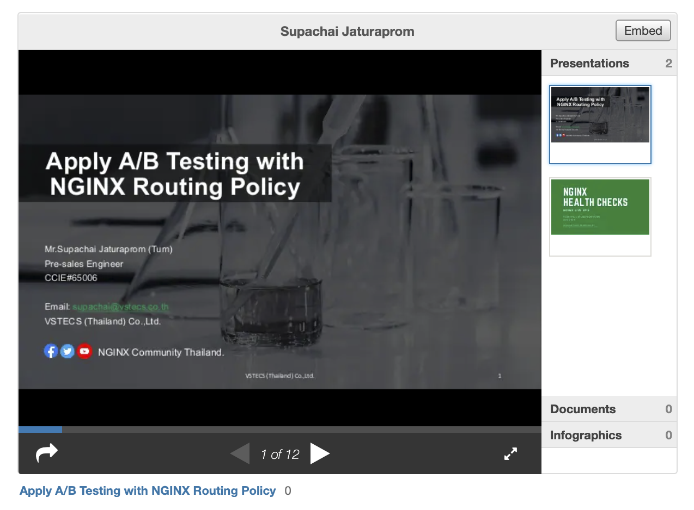

# สำหรับ NGINX Webinar Forum:  Apply A/B Testing with NGINX Routing Policy 
### เมื่อวันที่ 05/08/2021 เวลา 14.00–15.00 น.
### Presentation Slides Sharing


[Apply A/B Testing with NGINX Routing Policy slides sharing](https://bit.ly/ngxthailand-ab-tesing-nginx)


## ก่อนทำการทดสอบ ต้องทำการเตรียม ดังนี้
1. ติดตั้ง ```Docker Desktop``` บน PC หรือ ใช้ VM บน PC/Cloud แล้วติดตั้ง ```Docker``` และ ```Docker-compose```
2. กรณีที่ ต้องการทดสอบฟังก์ชัน ```Sticky Route``` และ ```JWT``` ของ **NGINX Plus** ต้องทำการ Build Docker Images โดย อ้างอิงจากเอกสารนี้
[Installing nginx docker](https://docs.nginx.com/nginx/admin-guide/installing-nginx/installing-nginx-docker)
3. ปกติ เราสามารถขอทดลองใช้ ``NGINX Plus`` 30 วัน ได้ จากลิ้งนี้ครับ [NGINX Plus Trial License](https://www.nginx.com/free-trial-request/)


## เนื้อหาทดสอบ A/B Testing ด้วย NGINX
- [Demo-1: How to A/B testing with Random Client Spliting](docs/demo-1-ab-testing-random-slipting.md)
- [Demo-2: A/B testing with sticky route.](docs/demo-1-ab-testing-random-slipting.md)
- [Demo-3: Dynamic A/B Testing with Multi-domain](docs/demo-3-ab-testing-dynamic-random-slipting.md)
- [Demo-4: A/B Testing with JWT](docs/demo-4-ab-testing-with-jwt-routing.md)


## อ้างอิงข้อมูลเพิ่มเติม:
- [NGINX Plus Trial License](https://www.nginx.com/free-trial-request/)
- [How to NGINX Plus Docker images](https://docs.nginx.com/nginx/admin-guide/installing-nginx/installing-nginx-docker/)
- [How to Split Test Traffic using NGINX](https://www.linkedin.com/pulse/how-split-test-traffic-using-nginx-shishir-dwivedi)
- [Performing A/B Testing with NGINX and NGINX Plus](https://www.nginx.com/blog/performing-a-b-testing-nginx-plus)
- [Dynamic A/B Testing with NGINX Plus](https://www.nginx.com/blog/dynamic-a-b-testing-with-nginx-plus)
- [Authentication and Content-Based Routing with JWTs and NGINX Plus](https://www.nginx.com/blog/authentication-content-based-routing-jwts-nginx-plus/)

การทดสอบนี้ เป็นตัวอย่าง แบบง่ายๆ ให้พอให้ภาพและสามารถต่อยอด ไอเดีย ได้เท่านั้น หวังว่า จะเป็นประโยชน์ ไม่มากก็น้อย ขอบคุณครับ

 Create by:

Mr. Supachai Jaturaprom (Tum).

FB Fanpage: [NGINX Community Thailand](https://www.facebook.com/nginx.community.thailand)\
Twitter: [NGINX Community Thailand](https://twitter.com/NginxThailand)\
Youtube: [NGINX Community Thailand](https://www.youtube.com/channel/UC6jRLyLwdKhR_HQtJ9DrToA)
