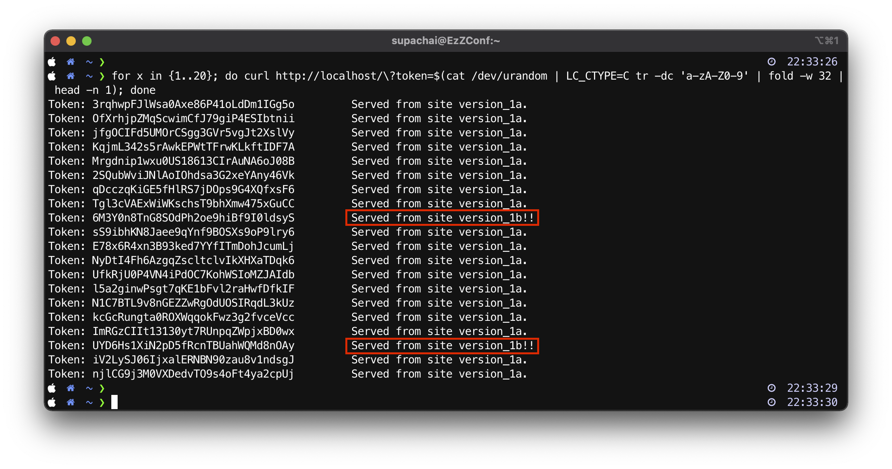

# Demo-1: A/B testing with random client spliting.
1.1) ทำการแก้ไขไฟล์ [docker-compose.yml](../docker-compose.yml) ดังนี้
```yaml
version: "3.7"
services:
    nginx:
        image: nginx:latest
        restart: always
        ports:
          - 80:80
        volumes:
           - ./conf/ab-testing-random-slipting.conf:/etc/nginx/nginx.conf
```
จากสั่ง run ก็ใช้คำสั่ง 
```sh
docker-compose up -d
```
ถ้าอยากดู logs แบบ realtime ของ nginx บน container ใช้คำสั่ง
```sh
docker-compose logs -f
```
1.2) ในการทดสอบนี้จะอ้างอิง nginx configuration จากไฟล์ [ab-testing-random-slipting.conf](../conf/ab-testing-random-slipting.conf) นี้ จะมีรายละเอียดที่เกี่ยวข้อง ดังนี้
```nginx
split_clients "${arg_token}" $dynamic {
                90%     version_1a;
                *       version_1b;
}
```
1.3) ทำการทดสอบใช้ Loop for เรียกโดยใช้ curl เรียกเข้าไปด้วยการ random ค่าของ ```Token argurment``` บน URI ดังนี้.
```sh
for x in {1..20}; do curl http://localhost/\?token=$(cat /dev/urandom | LC_CTYPE=C tr -dc 'a-zA-Z0-9' | fold -w 32 | head -n 1); done
```
*ถ้าทดสอบ MacOS แล้ว เจอ Error ให้ทำการเพิ่มคำสั่ง ```LC_CTYPE=C``` เข้าไปด้วย*

ตัวอย่าง การทดสอบ



1.4) ทำการลบ Container 
```sh
docker-compose down
```