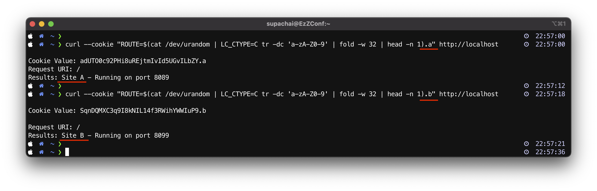
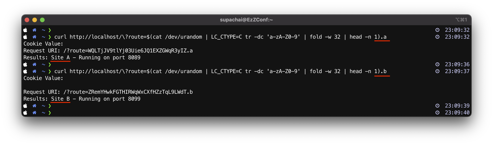

# Demo-2: A/B testing with sticky route.

2.1) ทำการแก้ไขไฟล์ [docker-compose.yml](../docker-compose.yml) ดังนี้
```yaml
version: "3.7"
services:
    nginx:
        image: nginx-plus:latest
        restart: always
        ports:
          - 80:80
        volumes:
           - ./conf/ab-testing-stickyroute.conf:/etc/nginx/nginx.conf
```
จากสั่ง run ก็ใช้คำสั่ง 
```sh
docker-compose up -d
```
ถ้าอยากดู logs แบบ realtime ของ nginx บน container ใช้คำสั่ง
```sh
docker-compose logs -f
```
2.2) ในการทดสอบนี้จะอ้างอิง nginx configuration จากไฟล์ [ab-testing-stickyroute.conf](conf/ab-testing-stickyroute.conf) 
```nginx
        map $cookie_route $route_cookie {
              ~\.(?P<route>\w+)$ $route;
        }

        map $arg_route $route_uri {
              ~\.(?P<route>\w+)$ $route;
        }

        upstream backend {
                zone backend 64k;
                server 127.0.0.1:8098 route=a;
                server 127.0.0.1:8099 route=b;

                sticky route $route_cookie $route_uri;
        }
```
2.3) ทำการทดสอบโดยใช้ ```Sticky Route ด้วย Cookie route``` ดังนี้

เรียกไปที่ Site A โดยใช้ ``.a``
```sh
curl --cookie "ROUTE=$(cat /dev/urandom | LC_CTYPE=C tr -dc 'a-zA-Z0-9' | fold -w 32 | head -n 1).a" http://localhost
```
เรียกไปที่ Site B โดยใช้ ``.b``
```sh
curl --cookie "ROUTE=$(cat /dev/urandom | LC_CTYPE=C tr -dc 'a-zA-Z0-9' | fold -w 32 | head -n 1).b" http://localhost
```
ตัวอย่าง การทดสอบ 


2.4) ทำการทดสอบโดยใช้ ```Sticky Route ด้วย argument route``` ดังนี้

เรียกไปที่ Site A โดยใช้ ``.a``
```sh
curl http://localhost/\?route=$(cat /dev/urandom | LC_CTYPE=C tr -dc 'a-zA-Z0-9' | fold -w 32 | head -n 1).a
```
เรียกไปที่ Site B โดยใช้ ``.b``
```sh
curl http://localhost/\?route=$(cat /dev/urandom | LC_CTYPE=C tr -dc 'a-zA-Z0-9' | fold -w 32 | head -n 1).b
```
ตัวอย่าง การทดสอบ 


2.5) ทำการลบ Container 
```sh
docker-compose down
```