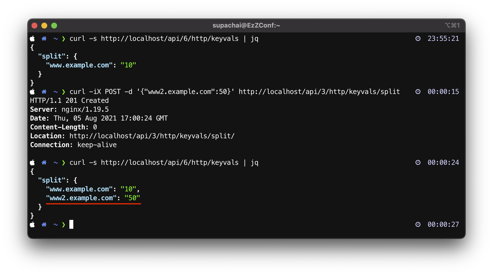

# Demo-3: How to Dynamic A/B testing with random client spliting.

3.1) ทำการแก้ไขไฟล์ [docker-compose.yml](../docker-compose.yml) ดังนี้
```yaml
version: "3.7"
services:
    nginx:
        image: nginx-plus:latest
        restart: always
        ports:
          - 80:80
        volumes:
            - ./conf/ab-testing-dynamic-random-slipting.conf:/etc/nginx/nginx.conf
            - ./conf/state_files:/etc/nginx/state_files
```
จากสั่ง run ก็ใช้คำสั่ง 
```sh
docker-compose up -d
```
ถ้าอยากดู logs แบบ realtime ของ nginx บน container ใช้คำสั่ง
```sh
docker-compose logs -f
```
3.2) ในการทดสอบนี้จะอ้างอิง nginx configuration จากไฟล์ [ab-testing-dynamic-random-slipting.conf](conf/ab-testing-dynamic-random-slipting.conf) 
```nginx
   keyval_zone zone=split:64k state=/etc/nginx/state_files/split.json;
    keyval $host $split_level zone=split;

    split_clients $client_ip $split0 {
        * appversion1;
    }
    split_clients $client_ip $split5 {
        5% appversion2;
        * appversion1;
    }
    split_clients $client_ip $split10 {
        10% appversion2;
        * appversion1;
    }
    split_clients $client_ip $split25 {
        25% appversion2;
        * appversion1;
    }
    split_clients $client_ip $split50 {
        50% appversion2;
        * appversion1;
    }
    split_clients $client_ip $split100 {
        * appversion2;
    }

    map $split_level $upstream {
        0 $split0;
        5 $split5;
        10 $split10;
        25 $split25;
        50 $split50;
        100 $split100;
        default $split0;
    }
```
และมีการกำหนดในส่วนของ server block
```nginx
server {
        listen 80;
        server_name "www.example.com";

        #set $client_ip $remote_addr; # Production
        set $client_ip $request_id; # Testing only

        location / {
            proxy_set_header Host $host;
            proxy_pass http://$upstream;
        }

        # Configure the NGINX Plus API and dashboard. For production, add directives
        # to restrict access to the API, for example 'allow' and 'deny'.
        location /api {
            api write=on;
            # in production, directives restricting access
        }

        location = /dashboard.html {
            root /usr/share/nginx/html;
        }

}
```
**สังเกต:** ว่าในการทดสอบนี้จะมีการใช้ ```key value store``` และ ```API``` สามารถอ่านข้อมูลเพิ่มเติมได้จาก [ngx_http_keyval_module](http://nginx.org/en/docs/http/ngx_http_keyval_module.html) และ  [ngx_http_api_module](http://nginx.org/en/docs/http/ngx_http_api_module.html)

3.3) ทำการทดสอบ โดยใช้

ทำการตรวจสอบ key value store บน nginx
```sh
curl -s http://localhost/api/6/http/keyvals | jq 
```
ทำการเพิ่ม key value 
```sh
curl -iX POST -d '{"www.example.com":50}' http://localhost/api/3/http/keyvals/split
```
ตัวอย่าง 


3.4) ทำการทดสอบเรียก ด้วยการกำหนดค่า host header ดังนี้
```
for x in {1..20}; do curl -H "Host: www.example.com" http://localhost/; done
```
ตัวอย่าง


3.5) ทำการทดสอบ อับเดตค่า key value จาก ``50 ไปเป็น 10``
```sh
curl -iX PATCH -d '{"www.example.com":10}' http://localhost/api/3/http/keyvals/split
```

```sh
curl -s http://localhost/api/6/http/keyvals | jq
```


3.6) ทำการทดสอบเพิ่ม key value ใหม่

```sh
curl -iX POST -d '{"www2.example.com":50}' http://localhost/api/3/http/keyvals/split
```
ตัวอย่าง


```sh
curl -iX PATCH -d '{"www2.example.com":100}' http://localhost/api/3/http/keyvals/split
```
ตัวอย่าง 

```sh
for x in {1..20}; do curl -H "Host: www2.example.com" http://localhost; done

for x in {1..20}; do curl -H "Host: www.example.com" http://localhost; done
```


3.7) ทำการลบ Container 
```sh
docker-compose down
```